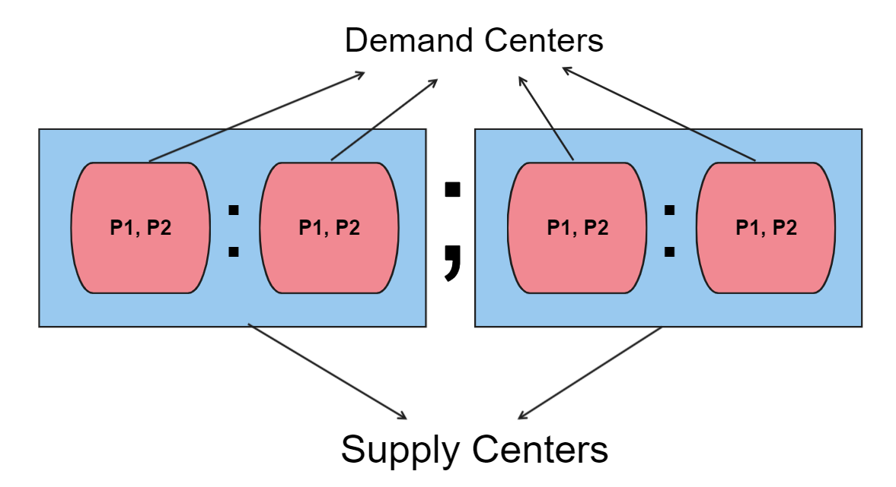

# Multi-Commodity Transportation 🚛 Problem Solver with Scipy 🔬🐍 and Kivy 🥝
###

The Multi-Commodity Transportation Problem Solver with Kivy UI is designed to solve Multi-commodity transportation problems given the following values: number of Supply Centers, number of Demand Centers, number of Types of Goods (products),
Supply Centers' Limits for each Types of Goods, Demand Centers' demands for each Types of Goods and the Transportation Cost of each Type of Good from each Supply Center to each
Demand Center, these information should be given to the app in the following format: 

The first three values are integers that represent the number of each Supply Center, Demand Center and Types of Goods. 
  
For the last three values the first one is the Supply Center's Limits for each Type of Goods which is given in multiple lists each in which we include the limit for goods index wise
and each list represent a Supply Center, the goods' limits should be separated with "," (comma) and the lists (Which represent Supply Centers) should be separated with ";" (semicolon). 

For the Demand Limits the values should be added like the Supply Limits but the only difference is that each list represent a Demand Center. 

The last values that should be added are Transportation Costs, which should be added in the following format: 

These values are nests lists which the numbers represent the Transportation
Cost of each Type of Good from each Demand Center index wise (the index of the numbers represent the costs and the index of the nested list (which itself is inside another list) represent the Demand Center
which is added in here we separate the Demand Centers (lists that represent them) with ":" (colon) and for the Supply Centers we separate them with ";" (semicolon). 

There is a button defined in the app that imports an example to better understand how to enter the values, in this example there are 2 Supply Centers, 2 Demand Centers and 2 Types of Goods
lets explain one instance of each imported values:

* 10 inside "10, 15; 20, 5" means that the Supply Center number one has a limit of 10 for the good number 1 and also 5 means that the Supply Center number 2 has limit of 5 for good number 2.
* 10 (first) inside "15, 10; 15, 10" means that the Demand Center number one demands 10 of good type 2, and so on.
* 4 (first) inside "2,3:3,2; 4,1:1,4" means that the cost of transporting Good Type 1 from Supply Center number 2 to Demand Center number 1 is $4, and so on.

For the Solver itself I used Scipy.linprog library, the documentations for it is available <a href="https://docs.scipy.org/doc/scipy/reference/optimize.linprog-highs.html" target="_blank">here.<a/>

